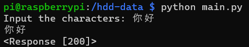
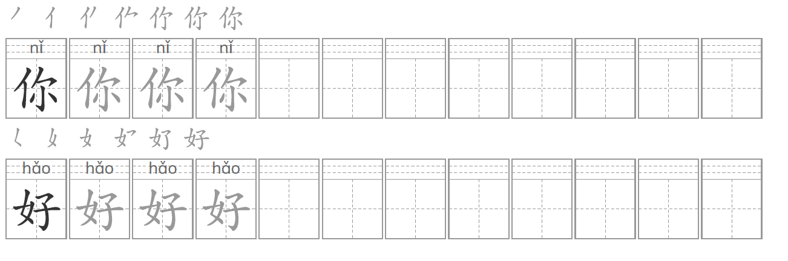

# chinese-character-writing-practice 

[简体中文](README_CN.md) | English | [Español](README_ES.md)

## Usage
Run the script with "python main.py" and enter the desired characters.

Once done, in the folder where you ran the script, several PDFs will have been created with the characters you entered.

## Credits

Powered by https://www.mangoworksheets.com
